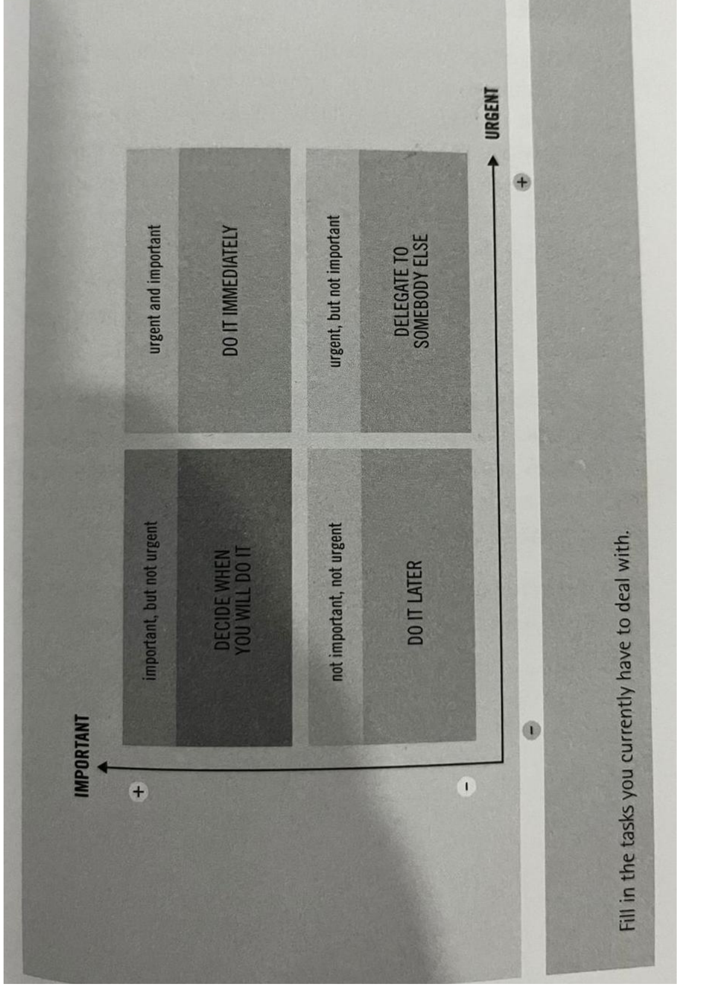
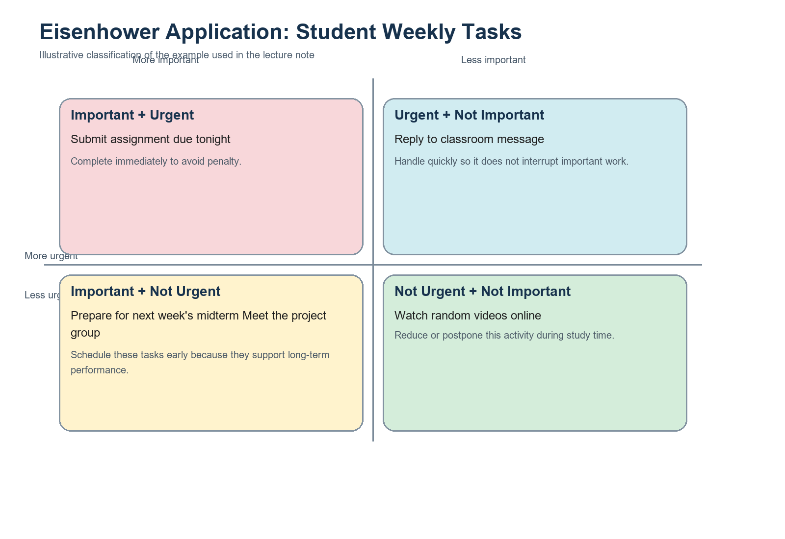
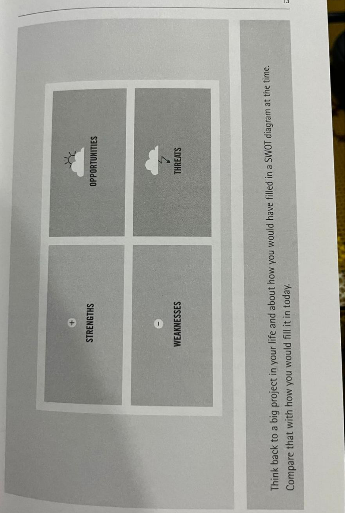
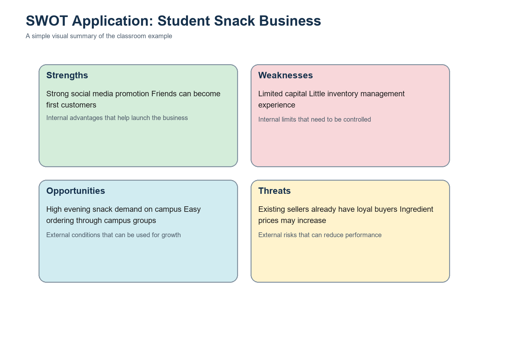
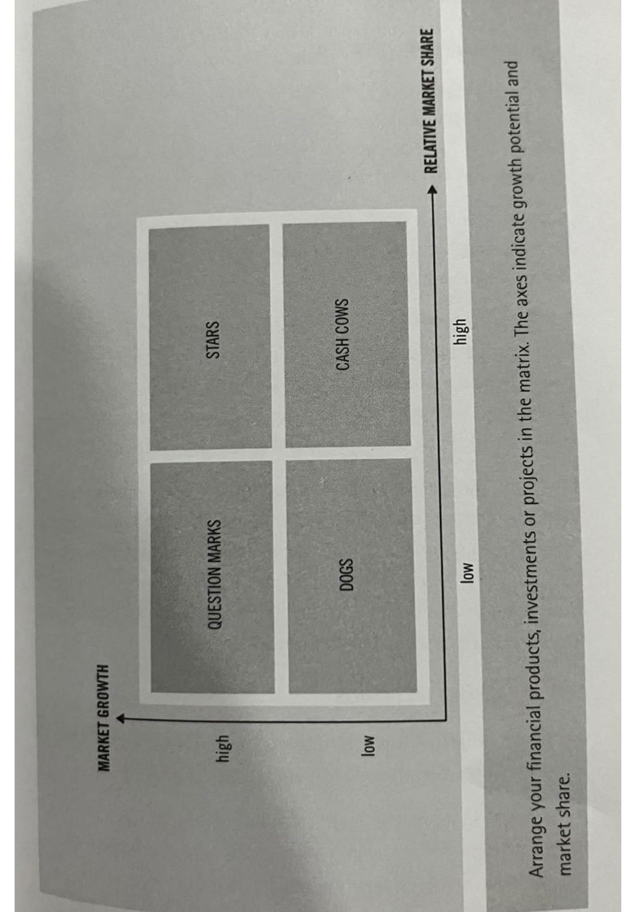
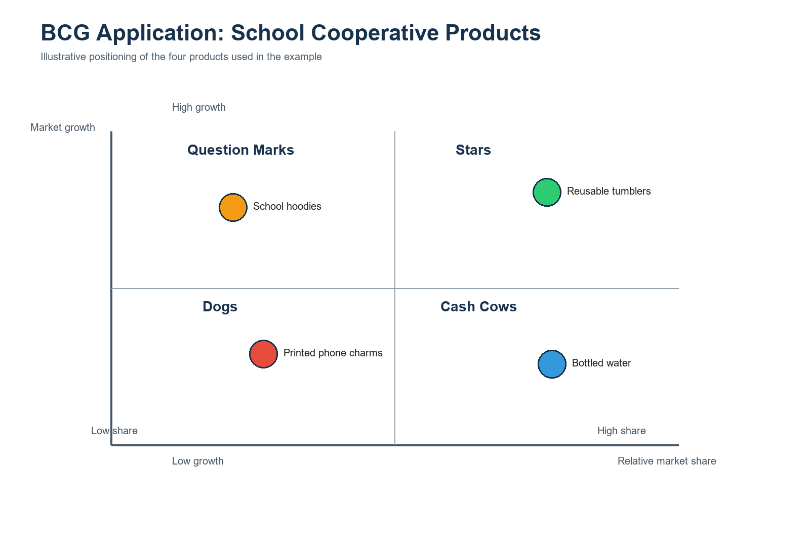

# Slide-Ready Notes: First Three Methods

Based on the first three methods from *The Decision Book* by Mikael Krogerus and Roman Tschappeler.

---

## Slide 1: Lesson Focus

### Three decision tools

- Eisenhower Matrix
- SWOT Analysis
- BCG Box

### Lesson goal

- organize tasks
- understand a decision situation
- evaluate products or projects

---

## Slide 2: The Eisenhower Matrix

### Core idea

- separate tasks by importance and urgency
- not everything urgent is important
- protect time for important long-term work

### Two questions

- Is it important?
- Is it urgent?

---

## Slide 3: Eisenhower Matrix Quadrants

### Four actions

- Important + urgent: do it now
- Important + not urgent: schedule it
- Urgent + not important: delegate it
- Not urgent + not important: do it later or drop it

### Figure

*Figure 1. The Eisenhower Matrix framework classifies tasks by urgency and importance to support priority setting and time allocation.*

---

## Slide 4: Eisenhower Example

### Case

A student must:

- submit an assignment tonight
- prepare for next week's midterm
- answer a simple class message
- watch random videos
- meet the project group

### Possible answers

- Do now: submit assignment
- Schedule: midterm study, project meeting
- Delegate or handle quickly: class message
- Reduce or remove: random videos

### Main takeaway

- important work should be planned before it becomes urgent

### Application figure

*Figure 1A. Example application of the Eisenhower Matrix to a student's weekly tasks, showing how assignment submission, exam preparation, routine messages, and distractions can be distributed across the four quadrants.*

---

## Slide 5: SWOT Analysis

### Core idea

SWOT helps us understand a situation before choosing an action.

### Four parts

- Strengths: internal advantages
- Weaknesses: internal limitations
- Opportunities: external chances
- Threats: external risks

---

## Slide 6: SWOT Questions

### Ask these questions

- What are we good at?
- Where are we weak?
- What chances can we use?
- What risks must we prepare for?

### Reminder

- SWOT is not just a list
- the goal is strategy

### Figure

*Figure 2. The SWOT framework organizes internal factors and external conditions to support structured situational analysis and strategic choice.*

---

## Slide 7: SWOT Example

### Case

A student wants to start an online snack business.

### SWOT summary

- Strengths: social media skills, first customers from friends
- Weaknesses: limited capital, little inventory experience
- Opportunities: strong campus demand, easy online ordering
- Threats: existing competitors, rising ingredient prices

### Decision

- start small
- focus on a clear niche
- manage stock carefully

### Application figure

*Figure 2A. Example application of SWOT analysis to a student snack business, showing how internal capabilities and limitations interact with external opportunities and threats.*

---

## Slide 8: The BCG Box

### Core idea

The BCG Box helps evaluate products, services, or projects in one portfolio.

### Two dimensions

- market growth
- relative market share

### Main purpose

- decide where to invest
- decide what to maintain
- decide what to test
- decide what to stop

---

## Slide 9: BCG Categories

### Four boxes

- Stars: high share, high growth
- Cash Cows: high share, low growth
- Question Marks: low share, high growth
- Dogs: low share, low growth

### Usual action

- Stars: invest
- Cash Cows: maintain and harvest returns
- Question Marks: analyze carefully
- Dogs: exit unless there is another reason to keep them

### Figure

*Figure 3. The BCG Box maps portfolio items according to market growth and relative market share to inform resource allocation decisions.*

---

## Slide 10: BCG Example

### Case

A school cooperative sells:

- bottled water
- school hoodies
- reusable tumblers
- printed phone charms

### Possible classification

- Star: reusable tumblers
- Cash Cow: bottled water
- Question Mark: school hoodies
- Dog: printed phone charms

### Decision

- invest in tumblers
- use bottled water for steady income
- test hoodie potential
- consider stopping phone charms

### Application figure

*Figure 3A. Example application of the BCG Box to a school cooperative product portfolio, positioning each product according to growth potential and relative strength.*

---

## Slide 11: Quick Comparison

| Method | Best for | Main question |
| --- | --- | --- |
| Eisenhower Matrix | prioritizing tasks | What should I do now, schedule, delegate, or drop? |
| SWOT Analysis | understanding a situation | What are our strengths, weaknesses, opportunities, and threats? |
| BCG Box | evaluating a portfolio | Where should we invest, maintain, test, or exit? |

---

## Slide 12: Class Activity

### Group work

- Group 1: use Eisenhower for student weekly tasks
- Group 2: use SWOT for a club event or business idea
- Group 3: use BCG for school products or programs

### Report back

- your classification
- your recommended action
- your assumptions

---

## Slide 13: Closing Message

- good decisions need structure
- these tools make thinking visible
- better decisions come from clearer analysis